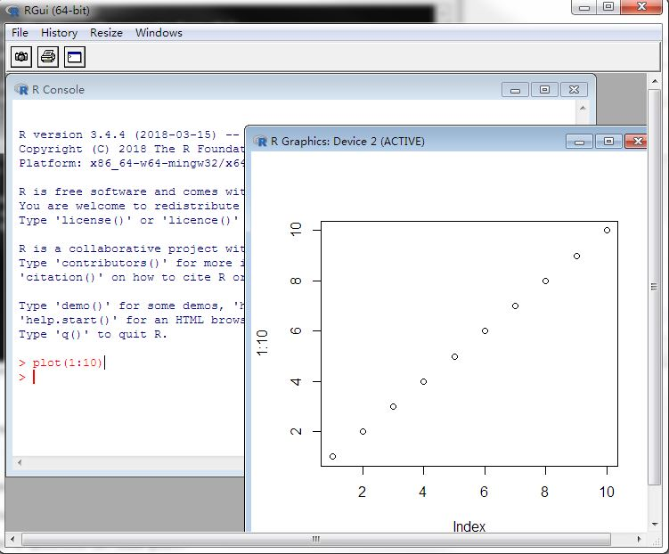
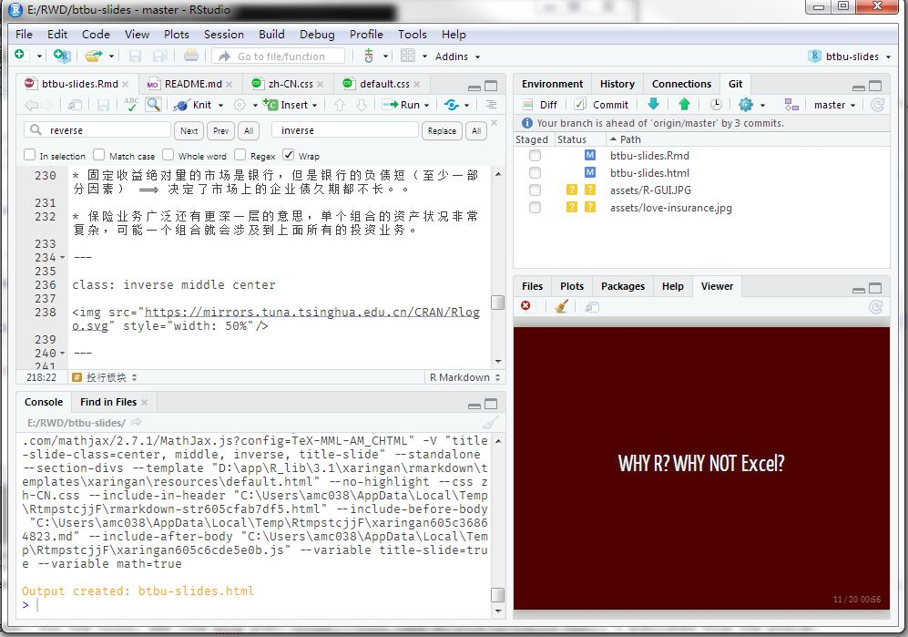

```{r setup, include=FALSE}
options(htmltools.dir.version = FALSE)
```

# 作者介绍

* 本科硕士均就读于南开大学保险系，精算学方向；

--

* 寿险公司精算部准备金评估处实习过，后来一直在保险资产管理公司工作，主要负责投资管理模型、股票量化投资模型等的搭建和维护。

--

* 职业：矿工(Quant) —— 码农(Code Monkey) —— 软件工程师(Soft Engineer)

--

* 对计算机知识比较了解，比较熟悉的语言和工具有：

    - R —— 重度使用患者，作为_“Interface Language”_适合和人类交互也适合和其他计算机程序交互；
    
    - C++ —— 速度快，稳定性强，但是坑多学习曲线陡峭，只用来构建计算量很大或者复杂度很高的模型中的核心部分；
    
    - SQL、数据库 —— 经常使用，但是对于写复杂的存储过程和各种嵌套完全没兴趣；
    
    - VBA / Excel —— 没啥好说的，金融保险职场必备技能；
    
    - VB.NET —— 从来没喜欢过，现在基本不用；
    
    - javascript, LaTeX等乱七八糟的 —— 马马虎虎能使。

???

* 简单带过，主要是分享一下自己的背景，便于同学们后续的理解。

* 语速尽可能地讲慢一点，把一个一个点讲清楚，不要求全面，能有一点点收获就好。

---

## 小小目标

--

* 对金融行业有一些简单了解、对保险资产管理公司干什么形成一些感性认识；

--

* “编程”并不“吓人”，也不“难”。“码字”能帮助自己把问题理解清楚、透彻。“码字”的过程中能够收获不一样的感觉 —— 创造事物的成就感；

--

* R语言很强大，非常适合在金融保险行业日常工作运用，可以用来完成很多有趣、也很实用的事情；

--

## 小小心愿

--

- 50%的童鞋对金融业、保险公司、保险资产管理公司有了些感性的认识；

- 20%的童鞋回家后能装上R和RStudio试一试；

- 5%的童鞋能发现用R写程序还有点意思。

--

### .center[就算是我个人的小小成功]

???

### 自我要求

* 尽可能地考虑到童鞋们的知识情况；

* 不求精确，但求能帮助童鞋们建立起“直觉”上的理解。

* 一定要充分考虑到受众的水平，多讲下可以做什么，可能很多童鞋从来都没有接触过任何程序。

* 估计对金融行业是干什么的，也没有直观认识和了解

---

background-image: url(assets/davidcohen-122135-unsplash.jpg)
background-size: cover

# 目录

.font-large[ 
* 保险资产管理公司业务介绍

* R介绍

* 案例分享

* Q&A
]

???

---

background-image: url(assets/financial-industry.jpg)
background-size: cover
class: middle center

# .font-white[金融行业]

---

## （不精确的）定义

在合法合规的前提下，解决资金需求和供给的问题。

--

## （不全面的）参与主体

金融行业参与主体众多，个人经验，从监管机构来梳理会比较清楚。

* 银保监会：银行（招商银行）、保险（中国人寿）、信托（兴业信托）、P2P；

* 证监会：券商（中信证券）、基金（华夏基金）、期货（华泰期货）、私募；

* 央行：互联网金融等

---

## 主要业务

* 投行业务 —— 解决资金需求方的问题 —— 怎么借钱？

    - 企业想要扩大生产 => 扩大生产需要购买生产资料（机器、工厂）=> 购买生产资料需要资金 => 资金从哪里来？ => 债、股。

* 资产管理业务 —— 解决资金供给方的问题 —— 怎么赚钱？

    - 银行理财
    
    - 公募基金
    
    - ……

* 其他：保险、外汇……

---


## 保险公司

--

* 寿险公司和财险公司的不同

--

* 寿险公司的盈利来源

--

* 保险公司的利润重要还是规模重要？

???

- 业务范围不用多说，主要的不同在于寿险公司资金规模大 <- 寿险储蓄性

- 间接导致了其盈利模式或者说是经营模式的不同，寿险公司

- 盈利来源：死、费、利率 —— 前两者很难提高，最后相对容易

- 规模大会带来规模效应（成本降低），更多可以运用的资源 —— 议价能力提升，更多的资源就是更大的平台，又意味着更好的人才。

---

## 保险资产管理公司


.pull-left[
### 投资板块

- 可以对照基金公司来理解，不同在于受银保监会监管（所以开展的业务不太一样），而且母公司是其主要的资金方；

- 客户群体：“合格投资者” —— 不能公募 —— 主要是保险机构和银行；

- 业务形态：资产委托的形式、保险资产产品的形式；

- 保险属性决定了其投资的风险容忍度不高（和风投正好相反），偏保守，但是业务广泛（股票、基金、存款、债权/股权投资计划、不动产、信托、衍生品（股指期货）等）。


]
    
.pull-right[
### 投行板块

- 帮助企业融资 ==> 发行基础设施债权计划、不动产债权计划和股权计划等 ==> 卖给保险公司；

- 什么是“债权计划”、“股权计划” —— 和银行、券商发行的债券有什么不同？

- 和银行、证券的投行部有什么不同？
]
    
    
???

* 债权计划主要是基础设施和不动产，特点都是久期比较长（期限长），和保险公司负债比较匹配；

* 原来的三会下面每个公司都可以有一种投行部门，银行发的债券在银行间交易、券商发的在交易所交易;

* 固定收益绝对量的市场是银行，但是银行的负债短（至少一部分因素） ==> 决定了市场上的企业债久期都不长。。

* 保险业务广泛还有更深一层的意思，单个组合的资产状况非常复杂，可能一个组合就会涉及到上面所有的投资业务。

---

class: inverse middle center

 

---

class: inverse middle center

# WHY R? WHY NOT Excel?

---

### EXCEL虽好，但不能贪杯

- 直观简单，容易上手

- 办公室基本每个人都有安装，分享自己的成果比较容易

- EXCEL公式、VBA、数据透视表等工具还是比较强大

- 作图比较漂亮，和OFFICE套件配合比较方便


### EXCEL的缺点

- 统计功能比较欠缺

- 很难把项目做大

    - 缺乏版本控制系统
    
    - 输入和输出没法控制，一不小心就把不相干的单元格更改了

- 很难完全自动化

    - 更新数据可能需要粘来粘去


---

# R的优点

- 适合偏统计的工作 —— 事实上大量的金融工作就是在做“统计实务”

- _Interface Language_ 适合和人交互，也能和其他语言交互

- 便利的帮助系统

    - [Introduction to data.table](https://mirrors.tuna.tsinghua.edu.cn/CRAN/web/packages/data.table/vignettes/datatable-intro.html)
    - [?dplyr::na_if](https://www.rdocumentation.org/packages/dplyr/versions/0.7.5/topics/na_if)

- 超级棒的R社区 —— 活跃的大神、大量的新工具…

- “真正”的计算机语言 —— 版本控制系统Git、单元测试、Package…

- 好用的Package生态

---


# 开源社区

The good times...

- Open sources

- RStudio 

- Hadley Wickham

- 谢益辉

- Rcpp

- data.table

- Github

- Machine learning

- Docker

- ...

---

class: inverse middle center
background-image: url(https://a-ssl.duitang.com/uploads/item/201511/25/20151125212058_hJfQR.thumb.700_0.png)
background-size: cover

# R究竟可以做什么？

---

# IT'S ALL ABOUT DATA

- 代替Eviews跑计量

- 各种各样的数据预处理和清晰

- 对接数据库、读取csv/excel等

- 通过文学化编程生成PDF报告

- 自己动手做package实现某个模型/算法

- 自动发个邮件？爬个虫？

- 做各种各样好看的可视化图形

- 利用shiny打造一个方便美观又强大的web app

- 对接调用tensorflow等机器学习框架

- ……

---

### 案例：（无聊的）线性回归

```{r}
set.seed(20)
y <- rnorm(100)
x <- rnorm(100)
model <- lm(y ~ x)
summary(model)
```

---

### 案例：（无聊的）线性回归

```{r lmplot}
plot(model, 1)
```
---

.pull-left[

### 案例：数据变换——data.table

```{r, message=FALSE}
library(data.table)
tbl <- data.table(ITEM = c("A", "A", "B", "B", "B"), VALUE = 1:5)
tbl[, .(VALUE = sum(VALUE)), keyby = ITEM]
tbl[, VALUE2 := cumsum(VALUE), by = ITEM][]
```

]


.pull-right[

### dplyr

```{r, message=FALSE}
library(dplyr)
tbl <- tibble(ITEM = c("A", "A", "B", "B", "B"), VALUE = 1:5)
tbl %>% group_by(ITEM) %>% summarize(VALUE = sum(VALUE))
tbl %>% group_by(ITEM) %>% mutate(VALUE2 = cumsum(VALUE))
```
]


---

### 读写Excel

```{r excel}
excel_file <- tempfile(fileext = "xlsx")
writexl::write_xlsx(iris, excel_file)
readxl::read_excel(excel_file)
```

---

### 案例 —— 数据可视化DT

```{r DT}
DT::datatable(iris) # yes, that simple!
```

---


### 案例 —— 数据可视化ggplot

```{r ggplot, message=FALSE, warning=FALSE, out.height="300px", out.width="600px", height=5, width=10}
library(ggplot2)
set.seed(100)
tbl <- data.frame(x = sample(LETTERS, 100, replace = TRUE))
p <- ggplot(tbl, aes(x = x)) + geom_histogram(stat = "count", fill = "skyblue")
plot(p)
```

---

### 案例 —— 数据可视化ggplotly

```{r ggplotly, message=FALSE, out.height="400px", out.width="600px"}
plotly::ggplotly(p)
```

---

### 案例 —— 和C++混合使用

```{r cpp}
Rcpp::cppFunction("NumericVector log_rtn(NumericVector simple_rtn) {
  NumericVector res(simple_rtn.size());
  std::transform(
    simple_rtn.begin(), simple_rtn.end(), res.begin(),
    [](const double x) { return std::log(x + 1.0); }
  );
  return res;
}", plugins = "cpp11")

simple_rtn <- c(0.03, 0.05, 0.08, -0.10, -0.02)
log(simple_rtn + 1.0) # R version
log_rtn(simple_rtn) # cpp version
```

---

### 案例 —— 创建网页APP

<iframe src="http://www.maptcm.net", width="100%", height="80%"></iframe>

---


class: center middle 

background-image: url(./assets/QA.jpg)

---

class: center middle inverse

# 末了

--

## 请一定记得用RStudio

---


.pull-left[
# R自带的GUI

 

### 并不是那么用户友好
]

--

.pull-right[
# 建议使用RStudio
 
]

---

class: center

# 谢谢

.left[
* Github: https://github.com/shrektan

* Email: [shrektan@126.com](mailto:shrektan@126.com)
]
